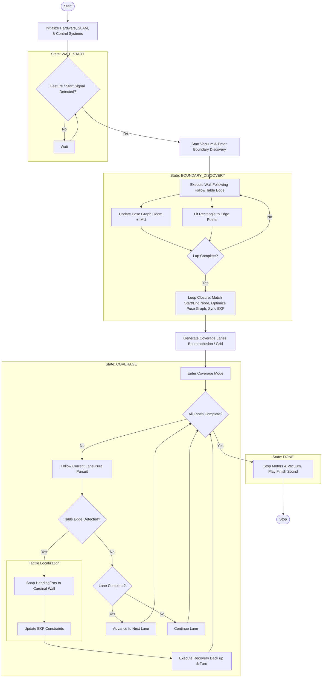

```mermaid
flowchart TD
    Start([Start])
    Init[Initialize Hardware, SLAM, & Control Systems]
    
    subgraph WAIT_START["State: WAIT_START"]
        WaitCheck{Gesture / Start Signal Detected?}
        Wait[Wait]
        WaitCheck -->|No| Wait
        Wait --> WaitCheck
    end
    
    StartVacuum[Start Vacuum & Enter Boundary Discovery]
    
    subgraph BOUNDARY_DISCOVERY["State: BOUNDARY_DISCOVERY"]
        WallFollow[Execute Wall Following Follow Table Edge]
        UpdatePose[Update Pose Graph Odom + IMU]
        FitRect[Fit Rectangle to Edge Points]
        LapCheck{Lap Complete?}
        LoopClosure[Loop Closure: Match Start/End Node, Optimize Pose Graph, Sync EKF]
        
        WallFollow --> UpdatePose
        WallFollow --> FitRect
        UpdatePose --> LapCheck
        FitRect --> LapCheck
        LapCheck -->|No| WallFollow
        LapCheck -->|Yes| LoopClosure
    end
    
    GenerateLanes[Generate Coverage Lanes Boustrophedon / Grid]
    
    subgraph COVERAGE["State: COVERAGE"]
        EnterCoverage[Enter Coverage Mode]
        AllLanesCheck{All Lanes Complete?}
        FollowLane[Follow Current Lane Pure Pursuit]
        EdgeDetected{Table Edge Detected?}
        
        subgraph TactileLocalization["Tactile Localization"]
            SnapHeading[Snap Heading/Pos to Cardinal Wall]
            UpdateEKF[Update EKF Constraints]
            SnapHeading --> UpdateEKF
        end
        
        Recovery[Execute Recovery Back up & Turn]
        LaneComplete{Lane Complete?}
        AdvanceLane[Advance to Next Lane]
        ContinueLane[Continue Lane]
        
        EnterCoverage --> AllLanesCheck
        AllLanesCheck -->|No| FollowLane
        FollowLane --> EdgeDetected
        EdgeDetected -->|Yes| SnapHeading
        UpdateEKF --> Recovery
        Recovery --> AllLanesCheck
        EdgeDetected -->|No| LaneComplete
        LaneComplete -->|Yes| AdvanceLane
        LaneComplete -->|No| ContinueLane
        AdvanceLane --> AllLanesCheck
        ContinueLane --> AllLanesCheck
    end
    
    subgraph DONE["State: DONE"]
        Stop[Stop Motors & Vacuum, Play Finish Sound]
    end
    
    StopNode([Stop])
    
    Start --> Init
    Init --> WaitCheck
    WaitCheck -->|Yes| StartVacuum
    StartVacuum --> WallFollow
    LoopClosure --> GenerateLanes
    GenerateLanes --> EnterCoverage
    AllLanesCheck -->|Yes| Stop
    Stop --> StopNode
```
