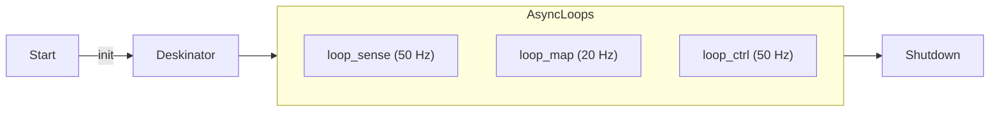

# Executive Summary  
Deskinator performs safe tabletop cleaning by fusing sensors, inferring boundaries, and executing coverage paths. Three async loops read sensors, build a map, and command motion. The system uses robust edge detection, rectangle inference, and boustrophedon planning to clean efficiently.

- Sense: Read APDS9960 proximity via TCA9548A, IMU yaw rate, and stepper odometry.
- Estimate: Fuse wheel odometry and gyro in an EKF to track pose.
- Map: Add pose graph nodes and optimize periodically with odometry and loop constraints.
- Boundary: Detect off-table edges using paired sensors with debounce and hysteresis.
- Infer: Fit a rectangle via RANSAC lines and orthogonality checks, then validate confidence.
- Plan: Build alternating boustrophedon lanes inside an inset rectangle with overlap.
- Control: FSM transitions from start to boundary, to coverage, then done or timeout.
- Navigate: Boundary follower uses edge balance and sway; path follower uses pure pursuit.
- Constrain: VelocityLimiter enforces acceleration and jerk limits for safe motion.
- Recover: Edge routine brakes, backoffs, rotates away, then sidesteps before resuming.
- Cover: SweptMap marks vacuum footprints during forward motion and computes coverage ratio.
- Operate: Vacuum and buzzer run via PWM; logs, visualizer, and Qt viewers provide feedback.

---

# config.py  
Central configuration for Deskinator. It defines hardware pins, I²C addresses, robot geometry, motion limits, and algorithm parameters.  

## Pins  
Defines Raspberry Pi GPIO assignments.  
- RIGHT_STEP, RIGHT_DIR, RIGHT_ENABLE  
- LEFT_STEP, LEFT_DIR, LEFT_ENABLE  
- VACUUM_PWM, BUZZER  
- GESTURE_SDA, GESTURE_SCL  

## I2CParams  
Sets main and gesture I²C buses, device addresses, and sensor channels.  
- BUS, GESTURE_BUS  
- ADDR_IMU, ADDR_MUX, APDS_ADDR, GESTURE_ADDR  
- MUX_CHANS, LEFT_PAIR, RIGHT_PAIR  

## Geometry  
Specifies physical dimensions and sensor offsets.  
- WHEEL_BASE, STEPS_PER_M  
- SENSOR_FWD, SENSOR_LAT  
- VAC_WIDTH, SENSOR_TO_VAC  

## Limits  
Motion safety bounds for speed, acceleration, and jerk.  
- V_MAX, V_REV_MAX, OMEGA_MAX  
- A_MAX, ALPHA_MAX, J_MAX  

## Algo  
SLAM and control parameters.  
- FUSE_HZ, EDGE_THRESH, EDGE_DEBOUNCE  
- NODE_SPACING, RECT_CONF_MIN_LEN, RECT_ORTHTOL_DEG  
- COVERAGE overlap, WATCHDOG timeouts  
- BOUNDARY gains, RECOVERY parameters  

PINS = Pins(), I2C = I2CParams(), GEOM = Geometry(), LIMS = Limits(), ALG = Algo()  

---

# main.py  
Orchestrates the Deskinator robot with three concurrent loops (sensing, mapping, control) using `asyncio`.  



## class Deskinator  
Initializes hardware, SLAM, planning, control, logging, and visualization.  

### Key Methods  
- `scan_i2c()`: Prints detected I²C devices  
- `calibrate_sensors()`: Calibrates APDS9960 sensors  
- `calibrate_imu()`: Calibrates MPU6050 gyro bias  
- `_await_gesture_start()`: Waits for hand gesture to start  
- `loop_sense()`: Reads odometry, IMU, and proximity; updates EKF  
- `loop_map()`: Adds pose graph nodes; fits rectangle; builds lanes  
- `loop_ctrl()`: Supervises FSM; computes velocity commands; logs data  
- `run()`: Entry point; sets up signal handler, awaits gesture, runs loops  
- `shutdown()`: Stops motors, vacuum, logs, and GPIO cleanup  

## main  
Parses `--viz`, `--calibrate`, and `--scan-i2c` flags and invokes Deskinator.  

---

# proximity_viewer.py  
Minimal PyQtGraph GUI to display normalized proximity from four front APDS9960 sensors and one start-gesture sensor.  

## class ProximityRig  
Handles I²C bus, multiplexing, sensor initialization, and raw/normalized readings.  
- `read()`: Returns `(values, raw_values)` for each sensor  
- `read_imu()`: Returns `(yaw, yaw_rate)` if IMU present  
- `close()`: Closes I²C resources  

## class ProximityViewer  
Plots a bar graph of live proximity readings and a compass-like IMU orientation.  
- Uses Qt timers to refresh at `--interval`  
- Displays raw counts scaled to 0–1  

## main  
Parses CLI args for I²C addresses, bus numbers, and calibration.  

---

# pose_viewer.py  
Lightweight PyQtGraph tool that tails the latest `telemetry_*.csv` and plots 2D trajectory and edge events.  

## TelemetryTail  
- Finds newest log file or uses `--file`  
- Incrementally reads new lines  
- Stores up to `--max-samples`  

## PoseViewer  
- Plots trajectory, start/end markers, and edge points  
- Updates every `--interval` seconds  
- Shows status label with timestamp and FSM state  

---

# stepper.py  
Implements `StepperDrive`, a background-threaded controller for two A4988 drivers in differential drive.  

## Features  
- 1/16 microstepping by default  
- Acceleration ramping and jerk limits  
- Generates STEP pulses with precise timing  
- Computes odometry `(dSL, dSR)` in meters  

### API  
```python
drive = StepperDrive(release_on_idle=True)
drive.command(v, omega)
dSL, dSR = drive.update(dt)
dSL, dSR = drive.read_odometry()
drive.stop()
drive.disable_drivers()
```  

---

# mpu6050.py  
Simplified MPU-6050 driver for yaw-only use. Falls back to simulation if I²C fails.  

## Key Methods  
- `_init_sensor()`: Configures gyro and accel ranges  
- `read_yaw_rate()`: Returns gyro Z in rad/s and integrates yaw  
- `read_yaw_abs()`: Returns integrated yaw  
- `bias_calibrate(duration)`: Computes yaw-rate bias over `duration` seconds  

---

# gesture.py  
Uses APDS9960 on a separate I²C bus for proximity-based start/stop. Falls back to simulation if `smbus2` is missing.  

## GestureSensor  
- Initializes gesture engine and proximity baseline  
- `is_hand_present()`: Debounced presence detection  
- `wait_for_hand_presence(timeout, hold_time)`  
- `read_gesture()`: Decodes UP/DOWN/LEFT/RIGHT gestures from FIFO  

---

# apds9960.py  
Driver for APDS9960 proximity sensor. Supports raw reads, normalization, and interactive calibration.  

## APDS9960  
- `init()`: Powers on and configures proximity mode  
- `read_proximity_raw()`: Returns 0–255 count  
- `read_proximity_norm()`: Scales to 0.0–1.0 using calibration  
- `calibrate(on_table_samples, off_table_samples)`: Computes offset/scale  

---

# tca9548a.py  
Driver for TCA9548A 8-channel I²C multiplexer.  

## TCA9548A  
- `select(channel)`: Enables one channel or disables all  
- `get_channel()`: Returns current channel  
- `disable_all()`: Shorthand to `select(None)`  

---

# i2c.py  
Abstracts `smbus2.SMBus` for hardware and simulation modes.  

## I2CBus  
- `write_byte`, `write_byte_data`, `read_byte_data`, etc.  
- `scan()`: Probes addresses 0x03–0x77 or simulates `[0x29, 0x39, 0x70]`  
- `close()`  

---

# gpio.py  
Thin wrapper over `RPi.GPIO` or simulated pins.  

## GPIOManager  
- `setup()`, `cleanup()`  
- `setup_output(pin, initial)`, `setup_input(pin)`  
- `output(pin, value)`, `input(pin)`  
- `pwm(pin, frequency)`: Returns hardware PWM or `SimPWM`  

---

# vacuum.py  
Controls a 12 V BLDC fan via PWM.  

## Vacuum  
- `on(duty)`: Starts or updates PWM duty 0.0–1.0  
- `off()`, `set_duty(duty)`  
- `cleanup()`  

---

# buzzer.py  
Produces audio feedback via PWM on a piezo buzzer.  

## Buzzer  
- `beep()`: Single beep  
- `beep_pattern(count, duration, pause)`  
- Preset patterns: `beep_start()`, `beep_finish()`, `beep_error()`, `beep_warning()`  
- `beep_async()`, `on()`, `off()`, `cleanup()`  

---

# logs.py  
Logs telemetry and edge detections to CSV files.  

## CSVLogger  
Handles file I/O and writes rows for given fieldnames.  

## TelemetryLogger  
- Creates `telemetry_*.csv` and `edges_*.csv` in `logs/`  
- `log_telemetry(...)` and `log_edge(...)` methods  
- `close()`  

---

# timing.py  
Provides loop timing and rate control utilities.  

## RateTimer  
- `sleep()`: Sleeps to maintain fixed Hz  

## LoopTimer  
- `start()`, `stop()`: Records iteration durations  
- `print_stats()`: Displays mean/max/min in ms  

---

# viz.py  
Matplotlib-based real-time visualization for SLAM map and coverage.  

## Visualizer  
- `update(poses, edge_points, rectangle, coverage_grid, bounds)`  
- `save(filename)`, `close()`  
- Offline plotting via `plot_trajectory_offline()`  

---

# slam/frames.py  
SE(2) coordinate transforms and utilities.  

- `wrap_angle(theta)`  
- `pose_compose(p1, p2)`, `pose_inverse(p)`, `pose_difference(p1, p2)`  
- `transform_point(pose, point)`, `transform_point_inverse(...)`  
- `rotation_matrix(theta)`, `pose_to_matrix()`, `matrix_to_pose()`  

---

# slam/ekf.py  
Extended Kalman Filter on SE(2).  

## EKF  
- State `[x, y, θ, (b_g)]`  
- `predict(dSL, dSR, dt)`: Wheel-odom integration  
- `update_gyro(omega_z, dt)`, `update_yaw_abs(yaw)`  
- `pose()`, `cov()`, `set_pose(x, y, θ)`  

---

# slam/posegraph.py  
Pose graph SLAM backend using NetworkX and SciPy least-squares.  

## PoseGraph  
- `add_node(t, pose)`, `add_edge_odom(i,j,z_ij,Info)`  
- `add_edge_yaw(i, yaw, Info)`, `maybe_add_loop(...)`  
- `optimize()`: Minimizes residuals of odometry, yaw, and loop constraints  
- `current_pose()`, `get_all_poses()`  

---

# slam/rect_fit.py  
Infers desk boundary as a rectangle via RANSAC line fitting and orthogonality checks.  

## RectangleFit  
- `add_edge_point(point)`  
- `fit()`: Fits four lines, checks orthogonality, and sets confidence  
- Accessors: `get_rectangle()`, `get_corners()`  

---

# planning/coverage.py  
Generates boustrophedon lanes inside inferred rectangle.  

## CoveragePlanner  
- `set_rectangle(rect)`  
- `build_lanes()`: Computes offset lanes with overlap, alternating direction  
- `get_current_waypoint()`, `advance_waypoint()`, `is_complete()`  

---

# planning/map2d.py  
Tracks swept coverage on a raster grid.  

## SweptMap  
- Auto-expands grid bounds if needed  
- `add_forward_sweep(pose, ds)`: Marks rectangular vacuum footprint  
- `coverage_ratio(rect)`  
- `get_grid()`, `is_swept(x, y)`  

---

# control/motion.py  
High-level motion control for boundary discovery, path following, and recovery.  

## MotionController  
- `cmd_boundary(pose, edge_ctx)`: Wall-following with sway  
- `cmd_follow_path(pose, path, swept_map)`: Pure-pursuit with coverage awareness  
- Edge event handler: `handle_edge_event(side)`, `update_edge_event(...)`  
- Watchdog recovery: `start_watchdog_recovery()`, `update_recovery(...)`  

---

# control/limits.py  
Applies acceleration and jerk constraints to velocity commands.  

## VelocityLimiter  
- `limit(v_target, omega_target, dt)`  
- `stop(dt)`, `reset()`, `compute_stopping_distance(v)`  

---

# control/fsm.py  
Supervises high-level robot phases: WAIT_START → BOUNDARY_DISCOVERY → COVERAGE → DONE.  

## SupervisorFSM  
- Manages timeouts and transitions based on context dict  
- States: `RobotState.WAIT_START`, `BOUNDARY_DISCOVERY`, `COVERAGE`, `DONE`, `ERROR`  

---

# Entry-point Scripts  

### distance_test.py  
Benchmarks motor distance accuracy by commanding a distance and measuring actual travel.  

### test_hardware.py  
Comprehensive wiring test covering I²C, multiplexer, proximity sensors, IMU, steppers, buzzer, and gesture sensor.  

### scan_i2c.py  
Scans main bus and each TCA9548A channel. Suggests updated `config.py` values.  

### manual_stepper_control.py  
Interactive WASD-based jog utility for Adafruit MotorKit steppers via keyboard.  

### fan_test.py  
Runs vacuum fan at full power for manual verification.  

### buzzer_test.py  
Plays various beep patterns to confirm buzzer functionality.  

### motor_test.py  
Sequences drive commands to test stepper motors and limits.  

---

# Project Metadata  

## requirements.txt  
Lists runtime dependencies: numpy, scipy, networkx, smbus2, matplotlib, pyqtgraph, RPi.GPIO, Adafruit libraries.  

## pyproject.toml  
Package info: `deskinator` v0.1.0, Python ≥3.10, optional `rpi` extras, console script `deskinator`.  

---

# Documentation & Guides  

### README.md  
Project overview, installation, usage, configuration, safety, and algorithm summaries.  

### HARDWARE_SETUP.md  
Step-by-step wiring and I²C setup guide with pull-up resistor notes and troubleshooting tips.  

### deskinator-slam-plan.md  
Detailed AI agent spec covering repository layout, HAL API, SLAM, rectangle inference, coverage planning, and control FSM.  

### outline.MD  
High-level design outline, state machine diagram, and minimal pseudocode skeleton.  

### todo.md  
Short TODO list for future improvements.  

---

**Deskinator** combines robust SLAM, safety via edge detection, and systematic coverage planning into an autonomous desk-cleaning robot. Each module is independently testable and configurable via `config.py`. Enjoy building and extending!